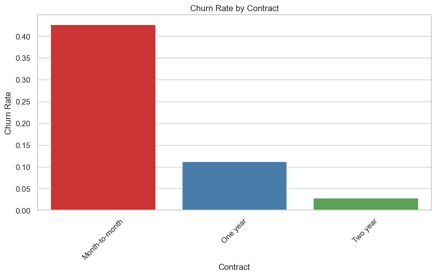
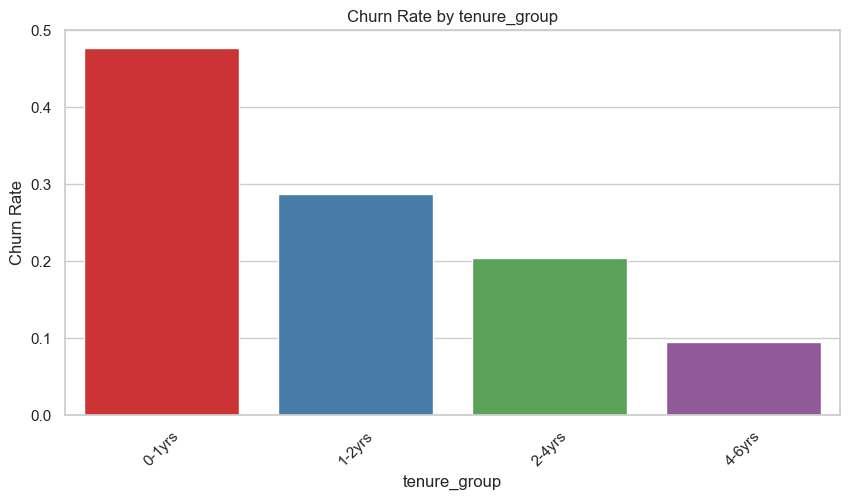
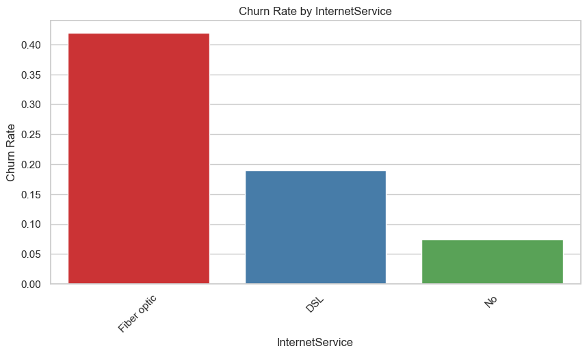
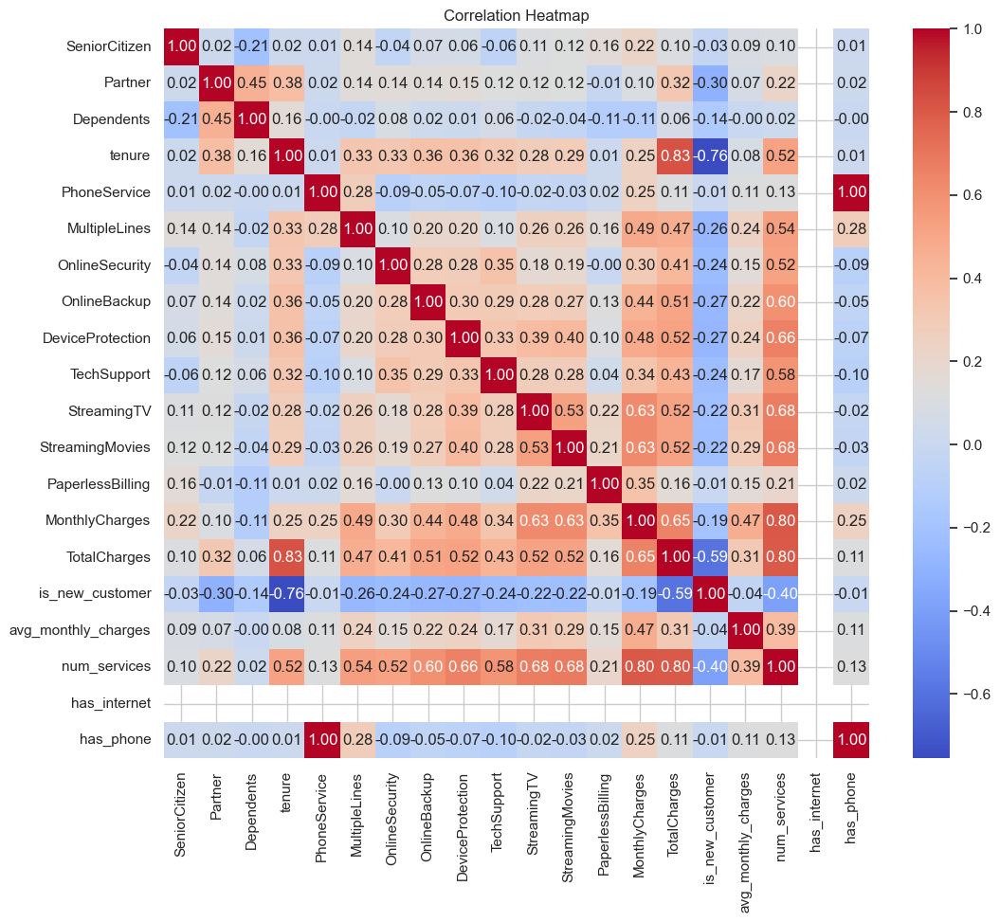
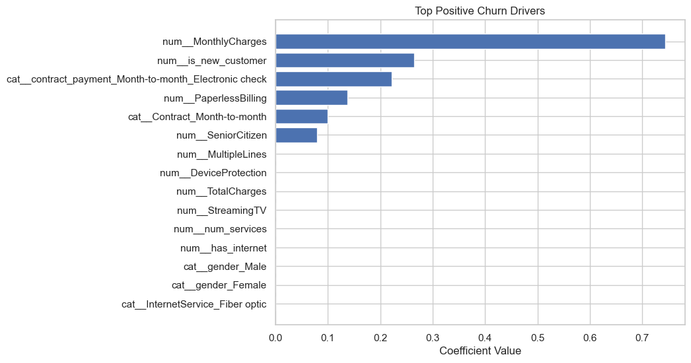

# Telco Customer Churn Prediction  
### Final Model Development, Evaluation, and Business Insights  
**Author:** koladefaj  
**Model:** XGBoost Classifier (Tuned)  
**Threshold:** 0.5503  

---

## 1. Executive Summary

This report outlines the development and optimization of a machine learning model used to predict customer churn for a telecom company. Because customer loss results in significant revenue impact, the business objective was to **maximize Recall** identifying as many potential churners as possible while maintaining strong Precision to minimize unnecessary retention costs.

The final tuned **XGBoost Classifier** delivered outstanding business value:

- **Recall:** 0.80  
- **Precision:** 0.58  
- **F1-Score:** 0.67  
- **ROC AUC:** 0.853  

This means the model successfully flags **8 out of 10 churners**, providing the Retention Team with a reliable and actionable list of high-risk customers.

---

## 2. Exploratory Data Analysis (EDA): Key Churn Drivers

### 2.1. Class Imbalance
- **73% Non-Churn**
- **27% Churn**

This imbalance required focusing on Recall, Precision, and F1-Score instead of Accuracy.


### 2.2. Contract Type (Most Influential Feature)
- Customers on **Month-to-month contracts** dominate the churn population.
- **1-year** and **2-year** contracts show high customer stability.



### 2.3. Tenure
- Churn is heavily concentrated among customers with **low tenure**, especially within the first 12 months.



### 2.4. Service-Related Factors
- **Fiber Optic** users have higher churn rates.
- Customers with **high monthly charges** are significantly more likely to cancel service.



### 2.5. Demographic Factors
Higher churn likelihood was found in:
- Senior citizens  
- Customers without partners  
- Customers without dependents  



These groups show lower long-term service commitment.

---

## 3. Model Development and Evaluation Strategy

### 3.1. Key Metrics
Because false negatives (missed churners) are more costly than false positives, primary metrics were:

- **Recall** — highest priority  
- **F1-Score** — balance between recall & precision  
- **Precision** — important for operational cost  
- **ROC AUC** — measures overall classification quality  

### 3.2. Baseline Performance

| Model                | Accuracy | Precision | Recall | F1 | ROC AUC |
|---------------------|----------|-----------|--------|-----|---------|
| Logistic Regression  | 0.81     | 0.65      | 0.50   | 0.56 | 0.84    |
| Random Forest        | 0.80     | 0.62      | 0.51   | 0.56 | 0.83    |
| LightGBM Baseline    | 0.76     | 0.55      | **0.82** | 0.66 | 0.78 |

Observation: boosting models delivered the strongest Recall.

---

## 4. Final Model Selection and Optimization

### 4.1. Final XGBoost Hyperparameters

```json
{
  "learning_rate": 0.1,
  "max_depth": 5,
  "n_estimators": 100,
  "subsample": 0.9,
  "colsample_bytree": 0.9,
  "scale_pos_weight": 2.7
}
```
These parameters provided the best balance between Recall, Precision, and stability.

### 4.2. Feature Importance
The model identified the following as the strongest churn predictors:
 • High MonthlyCharges → biggest churn driver
 • New customers (<12 months) are unstable and likely to leave
 • Electronic check billing strongly predicts churn
 • Month-to-month contracts → low commitment, easy to leave
 • Senior citizens show slightly higher churn rates

These insights can be used for:
 • Better retention campaigns
 • Adjusting pricing strategies
 • Improving onboarding for new customers

 

### 4.3. Threshold Optimization

Instead of the default 0.50 threshold, multiple thresholds were tested to meet business objectives.

|Setting	       |Threshold	|Recall	|Precision	|F1	    |Use Case|
|----------------|----------|-------|-----------|-------|--------|
|High Recall	   | ~0.40	  |   0.83|	  0.55	  | 0.66	|   Aggressive retention|
|Best F1	       | 0.5503	  |   0.80|	  0.58	  | 0.67	|    Balanced cost-effectiveness|

Chosen Threshold: 0.5503

### 4.4. Final Model Performance

Classification Report (Optimized Threshold 0.5503)

|Metric|	     Class 0 (Non-Churn)|	Class 1 (Churn)|
|------|--------------------------|----------------|
|Precision|	  0.91	              |   0.58         |
|Recall	  |    0.77	              |   0.80         |
|F1-Score	|  0.83	                | 0.67           |

Confusion Matrix

|	        |Pred 0	|     Pred 1|
|---------|-------|-----------|
|Actual 0	|588	   |      173 |
|Actual 1	|60	     |    236   |

The model successfully identifies 236 churners while misclassifying only 60.

## 5. Business Impact and Recommendations
### 5.1. Deployment Recommendation

Deploy the XGBoost model using threshold = 0.5503.

Integrate predictions into CRM or retention dashboards.

### 5.2. Targeted Retention Strategy

Focus on customers who are:

Month-to-month

Low tenure (< 12 months)

Fiber Optic users

Paying high monthly charges

These groups show the highest churn probability.

### 5.3. Monitor Program Costs

False Positives = 173 customers

Represents the cost of discounts or incentives offered unnecessarily

Compare operational cost vs. revenue saved from retaining the 236 true churners

## 6. Conclusion

The final XGBoost model provides a powerful, highly accurate churn prediction engine that aligns with business retention goals. By focusing on Recall and optimizing the classification threshold, the solution ensures that the company captures the maximum number of at-risk customers while maintaining operational efficiency.

This model is ready for production deployment, integration into CRM systems, and use in real customer retention campaigns.
